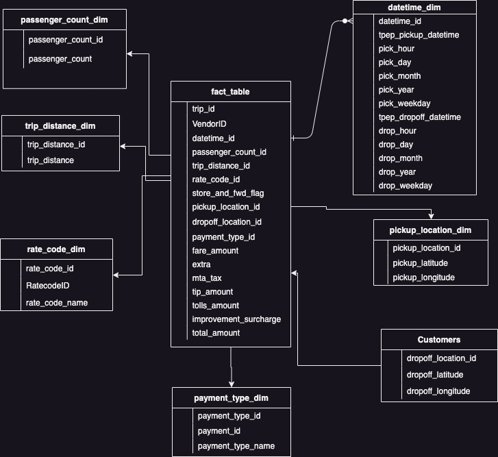
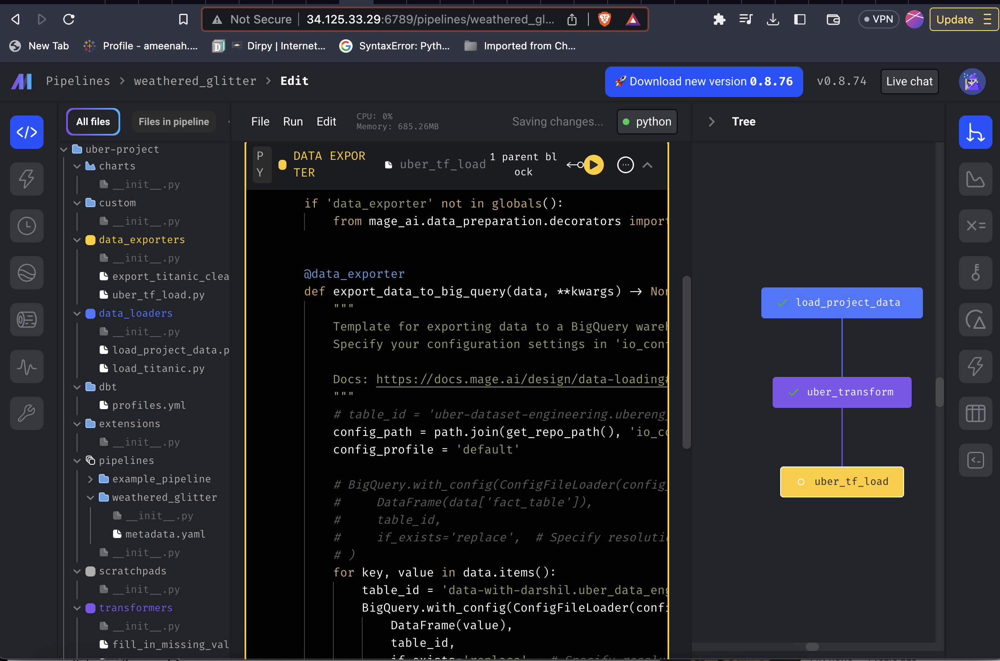
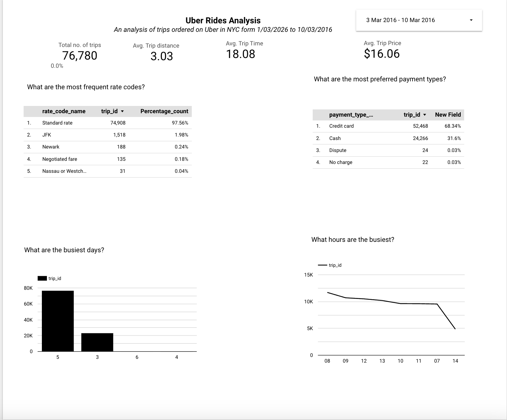

# ETL-on-Google-Cloud-Platform-using-Mage-AI-Big-Query-and-Looker
This repository contains the code and documentation for a data engineering project focused on building an ETL (Extract, Transform, Load) pipeline on the Google Cloud Platform (GCP). The project utilizes GCP services such as VM, BigQuery, Looker, and Mage.ai for efficient data processing and visualization using the uber data set found [here](https://www.nyc.gov/site/tlc/about/tlc-trip-record-data.page)

# Tools and Technologies
1. Google Platform
- [Compute Engine](https://cloud.google.com/compute) for Compute
- [Google Big query](https://cloud.google.com/bigquery)for data Storage
- [Looker](https://www.looker.com/) for Visualization

2. [Mage.ai](https://www.mage.ai) for Orchestration
3. draw.io for architecture diagram

# Project Overview
The main objective of this project is to create a robust and scalable ETL pipeline that extracts data from various sources, applies transformations, and loads it into BigQuery for analysis and reporting. The pipeline architecture involves the following key components:

[VM (Virtual Machine)](https://cloud.google.com/compute): A GCP VM instance is utilized to host and run the ETL pipeline. It provides the necessary computing resources and environment for executing data processing tasks.

[BigQuery](https://cloud.google.com/bigquery): As a fully managed and highly scalable data warehouse solution, BigQuery is used as the destination for storing and querying the transformed data. Its advanced querying capabilities and fast performance make it an ideal choice for handling large datasets.

[Looker](https://www.looker.com/): Looker, a powerful business intelligence and data visualization tool, is employed to create interactive dashboards and reports. These visualizations enable stakeholders to explore and analyze the data stored in BigQuery easily.

[Mage.ai](https://www.mage.ai): Mage.ai, an orchestration tool, is integrated into the pipeline to automate and manage the workflow. It simplifies the process of scheduling and executing ETL tasks, ensuring smooth data processing and timely delivery of insights.

# The Process
- Data Modeling

# Appendix
- [Images](./Images) - Project Images
- [Mage Files](Mage_Files) - Contains the source code for the ETL pipeline. This includes scripts for data extraction, transformation, and loading into BigQuery.
- Uber.ipynb
- [Serversetup.sh](./serversetup.sh) - Contains setup instructions and configuration details for VM.
- [Data](./uber_data.csv) - The data
