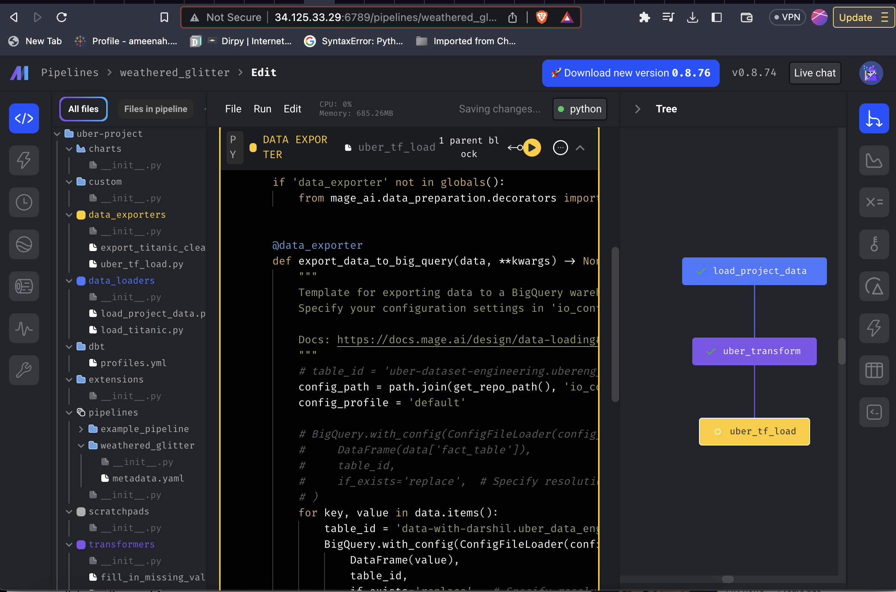
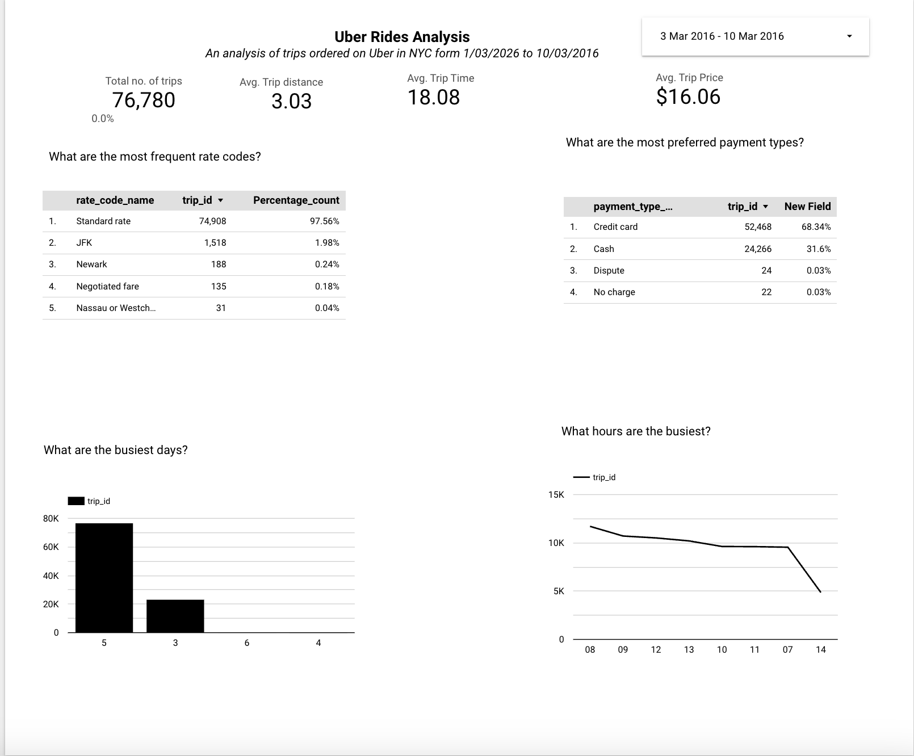

# ETL-on-Google-Cloud-Platform-using-Mage-AI-Big-Query-and-Looker
In this project, I built an end to end ETL pipeline that extracts, stores and analyzes the uber data set found here

# Tools and Technologies
# Google Platform
- Compute Engine 
- Google Big query for data Storage
- Looker for Visualization

# Mage.Ai for Orchestration

# The Process
- Data Modeling

